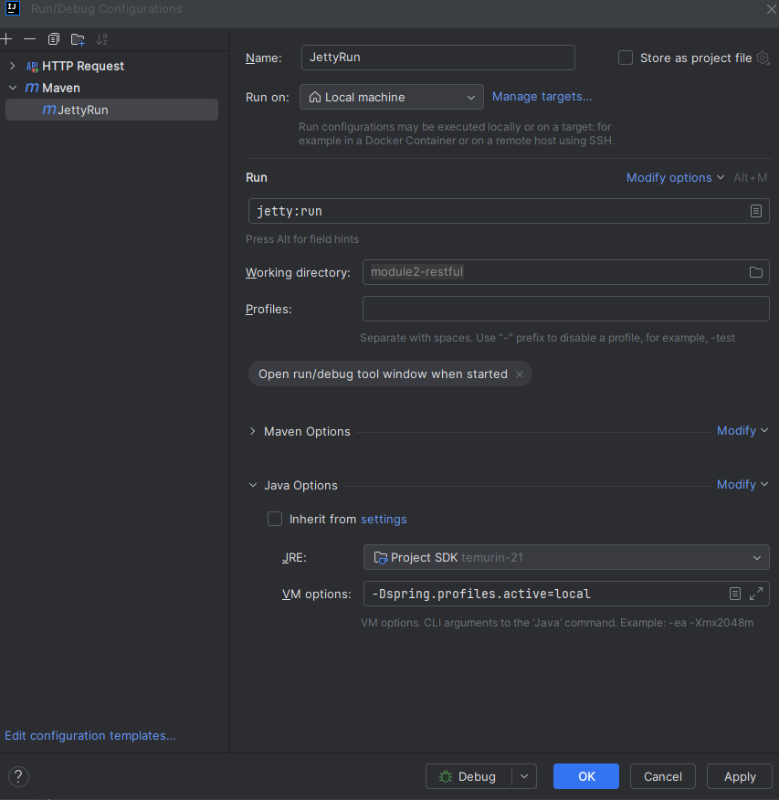

# Модуль 2: Сетевые протоколы. Реализация Rest в Spring

## RESTful WEB Service
Необходимо создать в новом проекте Spring приложение.

---

### Приложение должно иметь:

- несколько REST эндпоинтов, покрывающих все CRUD-операции (получение объекта, получение списка объектов, сохранение объекта, модификация объекта, удаление объекта), которые принимают и возвращают JSON;
- сервисный слой, содержащий бизнес-логику;
- слой дао/репозиториев (для работы с БД использовать Hibernate).

---

- Разумеется, все эти компоненты должны управляться Spring’ом. Допустимо использовать любой способ конфигурирования контекста: XML-based, Java-based, Annotation-based (кроме Groovy-based).
- Добавьте в свой Spring проект профили «prod» и «local». Для профиля «prod» необходимо подключаться к on-disk database (например, PostgreSQL). Для профиля «local» поднимайте in-memory database (например, H2) и предусмотрите заполнение БД стартовыми данными из SQL-скриптов.
- Напишите тесты для вашей функциональности, используя Spring-test и JUnit.
- Для описания подключения к БД и других настроек используйте property-файл.
- Примите во внимание то, что вы создаёте WEB приложение – оно должно быть соответствующим образом сконфигурировано и собрано. Допускается и даже приветствуется использование maven-плагина для вашего сервера (например, Tomcat, Jetty…).
  

#### *И самое главное – никакого Spring Boot!*

---

## Параметры запуска

### Создание базы данных для prod профиля
    - CREATE DATABASE module2-restful;
    - username and password = *postgres*
    - localhost:5432

### Для запуска есть два варианта:
1. Создать maven конфигурацию для запуска

   

2. Воспользоваться командной строкой для запуска > mvn jetty:run -D"spring.profiles.active=local/prod"

