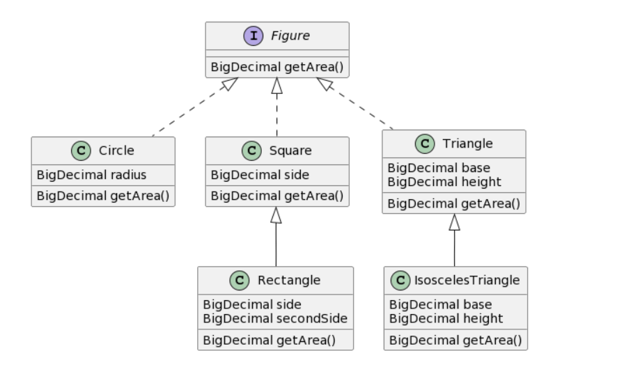

# Модуль 6: Records, Sealed-классы

#### Необходимо создать следующую иерархию классов:

#### И выполнить следующие требования:
1. Интерфейс `Figure` могут реализовывать только классы `Circle`, `Square` и `Triangle`.
2. Класс Circle должен быть record.
3. От класса `Square` может наследоваться только один класс `Rectangle`.
4. От класса `Rectangle` не может наследоваться никто.
5. От класса `Triangle` может наследоваться любой класс.

---

- [Реализацию классов можно посмотреть в пакете](src/main/java/com/reksoft/model)
- [Использование созданных классов можно посмотреть в методе main](src/main/java/com/reksoft/Bootstrap.java)